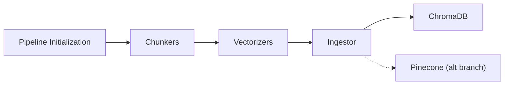

# Gutenberg Vectorization Pipeline

## Overview 🔎

I built this pipeline in response to my growing curiosity surrounding semantic embedding and retrieval augmented generation. This project targets this interest by processing, chunking, vectorizing, and storing previously downloaded text files from the [Gutenberg Project](https://www.gutenberg.org/).

The system is implemented as a **multi-stage asynchronous pipeline** in Python using a producer-consumer architecture. Workers are distributed processes via Python's `multiprocessing` library, enabling efficient processing of large corpora.

While this is not a "product" per se, it was a fun and digestible project that provided me with experience scaling text processing and semantic embedding generation.

 

## Key Features & Approach ⚡️

- **Text Chunking** - Extracts basic metadata from a given text file. Splits books into semantically meaningful segments for better embedding quality.
- **Embedding Generation** - Uses `all-MiniLM-L6-v2` to convert text chunks into high-dimensional vectors.
- **Parallellized Processing** - Employs multiprocessing to distribute tasks across worker processes.
- **Vector Storage** - Embeddings & metadata are persisted in `ChromaDB` for queries.
- **Benchmarking** - Runtime tests at varying process counts and storage backends to observe scaling behavior.
  > **Note** 📝: Benchmarks were limited to ~50 files due to hardware constraints (fanless laptop). The pipeline itself is designed to scale further, but embedding generation is inherently compute-intensive.

 

## Tech Stack & Highlights 🧰

- **Python** - Core pipeline, data processing, and task scheduling
- **Sentence-Transformers** - Emedding generation
- **ChromaDB / PineconeDB** - Vector storage
  > This project emphasizes scalable text processing, semantic understanding, and benchmarking trade-offs, rather than end-user deployment.

 

## System Overview ⚙️

1. **Pipeline Initialization** - Launches workers and distributes chunking tasks to `chunker.py`.
2. **Chunking** - Text files are split into semantically coherent segments and sent to `vectorizer.py`.
3. **Vectorization** - Embeddings are generated for each chunk and passed downstream.
   - **Main Branch** All embeddings are forwarded to a single `Ingestor` that batches and writes to `ChromaDB`.
   - **Pinecone Branch** Each vectorizer has its own lightweight ingestor instance to batch insert directly into Pinecone.

 

## Takeaways & Insights 💡

1. Gained hands-on experience with multi-threading in Python / battling the GIL.
2. Experimented with how factors such as worker count and storage solution impacted runtime.
3. Experienced first-hand how Amdahl's law applies to large scale text processing.
4. PineconeDB is a fantastic option for a truly distributed process; however, the overhead from the network IO outweighs the benefit from parallel inserts on one machine.
5. Benchmarking runs (at varying process counts and backends) reinforced the importance of aligning pipeline design with hardware constraints — embedding generation is computationally expensive, and thermal throttling on consumer hardware limited scaling beyond a certain point.

 

## Quicklinks

- [Pipeline Initialization](src/main.py)
- [Chunkers](src/chunker.py)
- [Vectorizers](src/vectorizer.py)
- [Ingestor](src/ingestor.py)
- [Pinecone (alt branch)](https://github.com/dev-pigeon/text-vectorization-pipeline/tree/pinecone)
